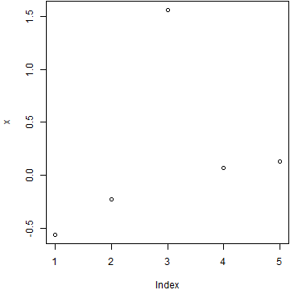

This is a special R script which can be used to generate a report. You can
write normal text in roxygen comments.

First we set up some options (you do not have to do this):


The report begins here.


```
## [1] 0.1935703
```

You can use the special syntax {{code}} to embed inline expressions, e.g.
`2.1935703`
is the mean of x plus 2.
The code itself may contain braces, but these are not checked.  Thus,
perfectly valid (though very strange) R code such as `{{2 + 3}} - {{4 - 5}}`
can lead to errors because `2 + 3}} - {{4 - 5` will be treated as inline code.

Now we continue writing the report. We can draw plots as well.



Actually you do not have to write chunk options, in which case knitr will use
default options. For example, the code below has no options attached:


```
## [1] 0.6577564
##          0%         25%         50%         75%        100% 
## -0.56047565 -0.23017749  0.07050839  0.12928774  1.55870831
```

And you can also write two chunks successively like this:


```
## [1] 2.818373
```

```
## [1] 2.631026
```

Done. Call spin('knitr-spin.R') to make silk from sow's ear now and knit a
lovely purse.
