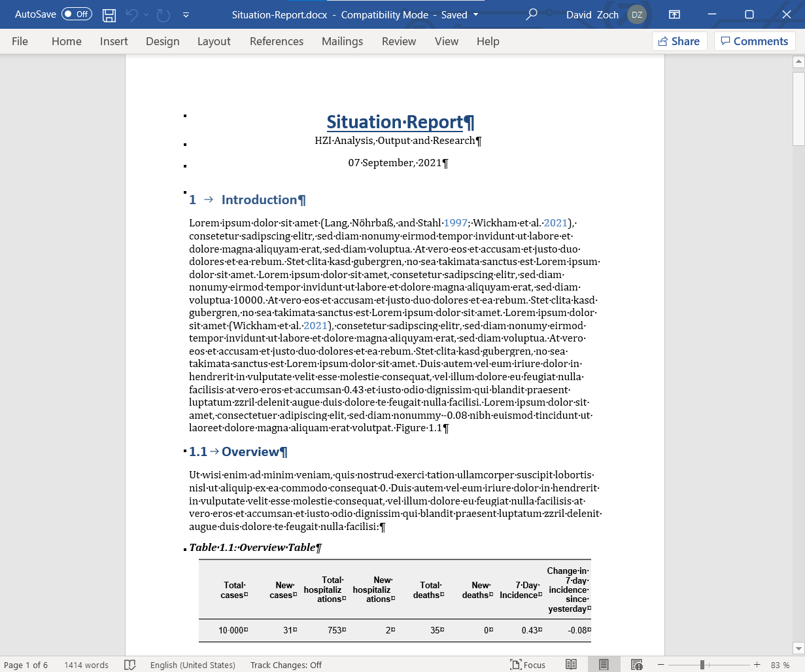
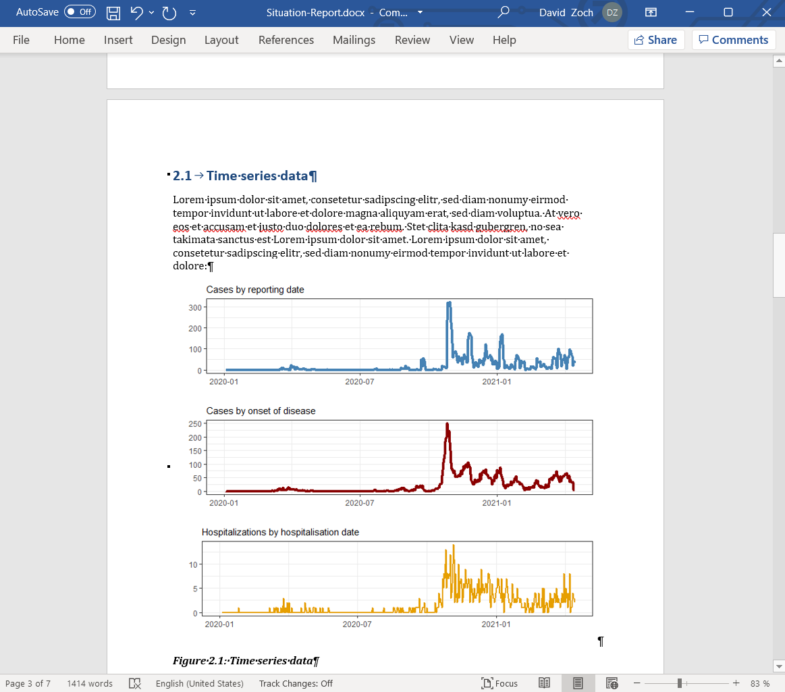

# SitRep

SitRep is a prototype for automated situation report generation based on a synthetic data set for SORMAS, a disease-surveillance and contact-tracing software. The synthethic dataset is generated by the sormasdatagen package https://gitlab.com/stephaneghozzi/sormasdatagen .

For population data the 2018 values from https://raw.githubusercontent.com/ostojanovic/BSTIM/master/data/raw/germany_population_data.csv
are used. SitRep supplements this data with an imputation process for the population numbers for people of the diverse gender,
which are available in the above data source. 

## Report structure and content

The report is generated as a word document with the title 'Situation-Report.docx'. The report contains 5 main sections:
Introduction, Epidemic dynamic, Regional situation, Remarks and References. These main sections and the corresponding subsections are structured in the following way:

#### 1 Introduction
##### 1.1 Overview
#### 2 Epidemic dynamic
##### 2.1 Time series data
##### 2.2 Death incidences by age group
#### 3 Regional situation
##### 3.1 State level table
##### 3.2 County level map
#### 4 Remarks
#### 5 References

Each section contains one to three paragraphs of lorem ipsum filler text.

In addition to that, ***Section 1.1 Overview*** contains an editable word table of 8 key indicators, which are calculated based on the test data:

- total case count
- new cases reported since yesterday
- total death count
- new deaths since yesterday
- total hospitalizations
- new hospitalizations since yesterday 
- seven-day incidence
- change in seven-day incidence since yesterday. 

***Section 2.1 Time series data*** contains one graphic with three plots:

- one time series with confirmed case count by reporting date 
- one time series of case counts by date of onset of disease 
- one time series of number of hospitalizations by date of hospitalization

***Section 2.2 Death incidences by age group*** contains one graphic with three plots for:

- distribution of death incidences according to 5-year age groups plus 80+ among males
- distribution of death incidences according to 5-year age groups plus 80+ among females
- distribution of death incidences according to 5-year age groups plus 80+ among people of diverse gender

N.B. As mentioned before the population numbers for the divesre gender are generated by an imputation process.
This imputation process assumes that the number of people of diverse gender is equal to 0.01% of female population in each age group.

***Section 3.1 State level table*** contains an editable word table of the same 8 key indicators used in section 1.1, but calculated on state level (NUTS-2) of the 16 german federal states (Bundesländer).

***Section 3.2 County level map*** contains a choropleth map of the county level (NUTS-3, Landkreise and Kreisfreie Städte) seven-day incidences. 

## Text, Referencing and Formatting 

***Displaying text***
The text that is displayed in the SitRep is taken from the .docx files in the /text folder of the SitRep Repository.
For each section and subsection there is a corresponding .docx file in the /text folder.
Users can define the text they want to display in their SitRep by altering the text in the corresponding .docx file.

***Paper references***
References to papers can be included via the references.bib and the .docx files in the /text folder.
First, the user needs to copy the BibTex reference of the paper he or she wants to cite in the references.bib file. 
Then, to define the place of the refence within the text, the user simply needs to put '[@refname]' in the text of the .docx file where the citation should be. To cite multiple references at once: '[@refname1;@refname2]'. refname is the BibTex reference name of the paper to be cited.

***Crossreferences to section headings***
For crossreferences to section headings the user needs to type 'Section \@ref(label)' in the text witin the .docx file in the /text folder.
'label' is the Section ID of the section to be cited, which is defined by through Pandoc as e.g. 'heading-one' for a Section named '# Heading one'. The user can define section IDs by adding '{#userdefinedID}' behind a heading, e.g. '# Heading {#userdefinedID}'.

***Crossreferences to figures***
For crossreferences to figures the user needs to type 'Figure \@ref(fig:FigName)' in the text witin the .docx file in the /text folder. FigName is the name of the figure to be cited, which is defined in the chunk options of the Situation-Report.Rmd file.

***Crossreferences to tables***
For crossreferences to tables the user needs to type 'Table \@ref(tab:TabName)' in the text witin the .docx file in the /text
folder. TabName is the name of the table to be cited, which is defined in the chunk options of the Situation-Report.Rmd file.

## Situation Report References

The Covid-19 situation reports of the RKI, NCDC and WHO served as references for the structure of the SitRep situation report.
https://www.who.int/emergencies/diseases/novel-coronavirus-2019/situation-reports
https://ncdc.gov.ng/diseases/sitreps/?cat=14&name=An%20update%20of%20COVID-19%20outbreak%20in%20Nigeria
https://www.rki.de/DE/Content/InfAZ/N/Neuartiges_Coronavirus/Situationsberichte/Gesamt.html

## To-Do / Potential Extensions

- Splitting the figures up into one figure for each individual graphs. Right now three graphs are contained in one figure. This would increase layout flexibility.

- Outputting the graphs in a format that is editable within word. 

## Example Images

### Introduction including Overview Table and References

### Timeseries data graphs

### Choropleth map of county level incidence

